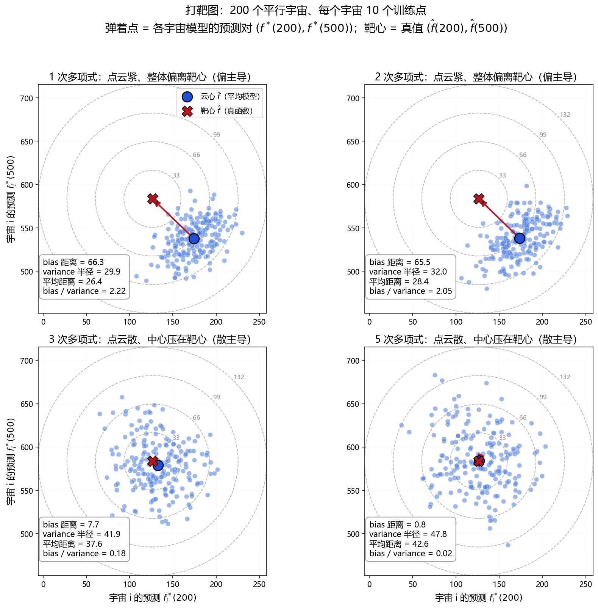
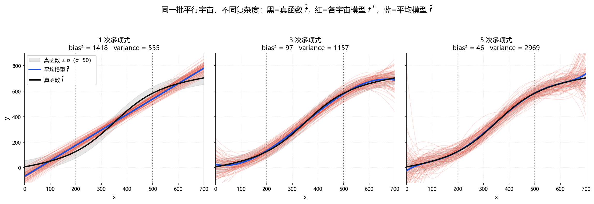
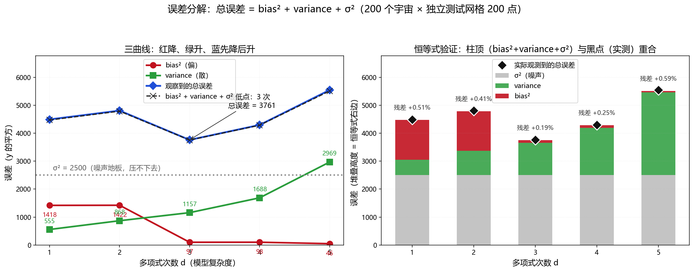
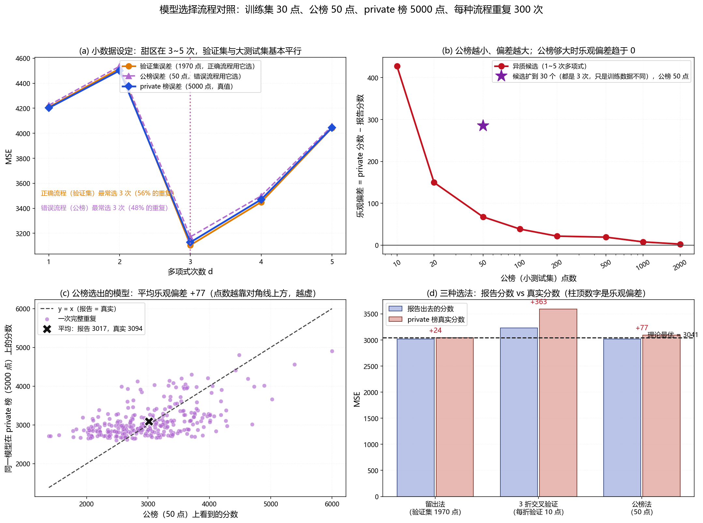

# 《Bias and Variance》四模块复现实验：打靶图、平行宇宙、误差分解、模型选择

这是配合李宏毅《Bias and Variance》那一章的教学实验。PPT 在这一章依次做了四件事：
画一张打靶图说明 bias 与 variance 的区别、画出 100 个"平行宇宙"训出来的曲线叠图、
把测试误差拆成 bias² + variance + σ² 三条曲线、最后讲模型该怎么选（验证集 / 交叉验证，
以及为什么不能用 public 榜调模型）。本实验把这四页全部变成可运行、可复现、可量化的代码，
每一页都给出对应的 PNG 图和可以核对的具体数字。

全部产出在 `results/` 下，原始数值记录在 `results/metrics.txt`。

一句话结论：**在这条 S 形真函数 + 10 个训练点的设定下，1 次多项式紧而偏、5 次多项式散而中，
总误差在 3 次取到最小值；误差分解的恒等式在 5 个次数上的相对残差都不超过 0.6%；
用 50 点 public 榜选模型会让报告分数平均虚高 77~232 分、选中的模型比最优模型差 52 分，
而用 1970 点验证集选模型只差 2.5 分。**

---

## 一、这个实验要说明什么

这一章要回答的问题是：**一个模型的测试误差，凭什么可以被拆成"偏"和"散"两块？**

测试误差是模型在新数据上的表现。它之所以不好理解，是因为它混了三样东西：

1. **模型太简单造成的偏（bias）**：1 次多项式是一条直线，它画不出 S 形，无论拿多少数据都画不出；
2. **模型太复杂造成的散（variance）**：5 次多项式有 6 个自由参数，而训练数据只有 10 个点，
   换一批数据就能训出一条形状完全不同的曲线；
3. **数据本身的噪声（σ²）**：y 是带噪声观测到的，就算模型完全等于真函数，误差也不可能为 0。

PPT 用"平行宇宙"这个思想实验把三者分开：想象有 200 个平行世界，每个世界都独立地抽 10 个训练点、
各训一个模型 f*。因为真函数 f 只有上帝知道，人只能看到"某一个世界的模型"；
但做实验的人可以假装自己是上帝，把这 200 个模型全部收集起来，于是：

- **bias** 由"200 个模型的平均 f̄ "与真值 f 的差距刻画——模型族本身就画不出真函数的那部分；
- **variance** 由"200 个模型彼此之间的散布"刻画——换一批数据就换一个样子的那部分；
- 剩下的就是 σ²，谁也躲不掉。

有了这三块，这一章几乎所有结论都能算出来：模型越复杂，bias 越小、variance 越大；
总误差是三者之和，所以存在一个"甜区"；选模型时必须用另一批数据估这个总误差，
而且要估得准（用验证集/交叉验证），不能用小测试集（public 榜），否则你是从一堆候选里
挑"运气最好的那个"，报出去的分数必然虚高。

---

## 二、与 PPT 页的对应关系

| PPT 上的元素 | 本实验的对应实现 | 代码位置 |
| --- | --- | --- |
| 一条 S 形真函数曲线（黑色） | 500·sigmoid((x−350)/80) + 0.3·x，画在图 02/图 03 上 | `model.py` 的 `true_function` |
| 每次实验只抽 10 个训练点 | `n_train=10`，等宽分层抽样（见 5.3） | `model.py` 的 `sample_dataset` |
| 训练点带噪声 | y = f(x) + ε，ε ~ N(0, 50²) | `model.py` 的 `sample_dataset` |
| 1/2/3/5 次多项式拟合 | 最小二乘闭式解（无梯度下降） | `model.py` 的 `fit_polynomial` |
| 红、蓝两个靶（"偏"与"散"的示意） | 图 01 的四个靶：靶心 = 真值，云心 = 平均模型 | `figures.py` 的 `figure_target_diagram` |
| 100 条曲线叠图（黑/红/蓝三色） | 图 02：黑=真函数，100 条红=100 个宇宙的 f*，蓝=平均模型 f̄ | `figures.py` 的 `figure_parallel_universes` |
| bias² / variance 两条随次数变化的曲线 | 图 03 左：红=bias²，绿=variance，蓝=观察总误差，灰虚线=σ² | `figures.py` 的 `figure_error_decomposition` |
| 总误差 = bias² + variance + σ² | 恒等式逐次数验证，残差写进 `metrics.txt` 第三节 | `analysis.py` 的 `identity_rows` |
| 用验证集选模型 | 留出法：2000 点池子切 30 训练 / 1970 验证 | `analysis.py` 的 `repeated_selection_experiment` |
| 用交叉验证选模型 | 3 折交叉验证：30 个训练点内部再切 3 折 | `analysis.py` 的 `_cross_validation_error` |
| public 榜调模型会在 private 榜翻车 | 50 点 public 榜选模型 vs 5000 点 private 榜报数 | `analysis.py` 的 `board_size_sweep` |

需要说明两处本实验**额外加**的东西（PPT 上没有，但能让结论更硬）：

- **杠杆值检查**（`metrics.txt` 第三节之二）：PPT 只给结论"越复杂 variance 越大"，
  本实验进一步把实测方差拆成"噪声项 σ²·h(x)"与"设计项"两块并逐位对上
  （h 是设计矩阵的杠杆值），把"为什么大"落到具体公式上；
- **公榜大小扫描与候选数扫描**（图 04 的 (b) 与 `metrics.txt` 第五节的第二、三块）：
  PPT 只讲"不要用 public 榜"，本实验把公榜从 10 点扫到 2000 点、把候选从 5 个扩到 30 个，
  量出乐观偏差具体有多大、随什么变化。

---

## 三、公式：误差分解恒等式与它的推导

这一节把 PPT 上那三条曲线的数学推导补全。所有公式符号都与后面的代码、`metrics.txt` 对应。

### 3.1 记号

- f(x)：真函数，只有上帝知道，代码里是 `true_function`；
- D_i：第 i 个平行宇宙抽到的训练集（10 个点），i = 1 … M，M = 200；
- f*_i(x)：用 D_i 训出来的模型（1~5 次多项式之一），代码里是 `predictions[degree][i]`；
- f̄(x)：所有宇宙模型的平均，f̄(x) = (1/M)·Σ_i f*_i(x)，代码里是 `f_bar`；
- y = f(x) + ε'：测试点上观测到的目标，ε' ~ N(0, σ²)，且 ε' 与 D_i 互相独立；
- G = 200：测试网格的点数，网格是 x ∈ [0, 700] 上的 200 个等距点。

### 3.2 第一步：把测试误差拆成"模型误差 + 噪声"

对某一个固定的测试点 x，看这个宇宙的平方误差：

```
(y − f*_i(x))² = (f(x) − f*_i(x))² + 2·ε'·(f(x) − f*_i(x)) + ε'²
```

三部分分别是"模型与真值的差"、"模型差与噪声的交叉项"、"噪声自己"。
对 ε' 取期望：交叉项里 E[ε'] = 0，而 f*_i 与 ε' 独立（测试噪声没参与训练），所以交叉项消失；
ε'² 的期望就是 σ²：

$$E_{\varepsilon'}\left[(y - f^*_i(x))^2\right] = (f(x) - f^*_i(x))^2 + \sigma^2$$

这一步就是 PPT 说的"**总误差里有一部分是噪声，谁也压不下去**"。σ² = 2500 是本实验的地板。

### 3.3 第二步：把模型误差拆成"偏"与"散"（关键一步）

现在看 (f − f*_i)²。插入平均模型 f̄ 做加一项减一项：

```
f(x) − f*_i(x) = [ f(x) − f̄(x) ] + [ f̄(x) − f*_i(x) ]
                 └─ 第一项与宇宙无关 ─┘  └─ 第二项随宇宙变化 ─┘
```

平方展开后有三项：两个平方项，加两倍交叉项。对训练集 D 取期望时，交叉项会消失，
因为 E_D[ f*_i(x) ] = f̄(x)（f̄ 本来就是这样定义的），于是
E_D[ f̄(x) − f*_i(x) ] = 0，交叉项的期望等于 2·[f(x) − f̄(x)]·E_D[f̄(x) − f*_i(x)] = 0。剩下：

$$E_{D}\left[(f(x) - f^*_i(x))^2\right] = \underbrace{\left(f(x) - \bar{f}(x)\right)^2}_{\text{bias}^2(x)} + \underbrace{E_D\left[\left(\bar{f}(x) - f^*_i(x)\right)^2\right]}_{\text{var}(x)}$$

- 第一项 **bias²**：平均模型离真函数多远——**天花板**性质，模型族画不出来的部分，
  换再多数据也不会消失（只会让 f̄ 更准，但如果模型族本身表达不了 f，bias² 就一直在）；
- 第二项 **var**：各个宇宙的模型围绕平均模型怎么抖——**数据敏感性**，
  换一批数据就换一个样子，σ² 越大、参数越多、数据越少，这一项越大。

实验中怎么算这两个量（都按网格点取平均）：

$$\text{bias}^2 = \frac{1}{G}\sum_{g=1}^{G}\left(\bar{f}(x_g) - f(x_g)\right)^2$$

$$\text{var} = \frac{1}{G}\sum_{g=1}^{G}\ \frac{1}{M-1}\sum_{i=1}^{M}\left(f^*_i(x_g) - \bar{f}(x_g)\right)^2$$

注意第二式里除的是 M − 1 而不是 M：用样本均值 f̄ 代替真实期望 f̄* 会系统性低估算 1/M，
M = 200 时约 0.5%。用 M − 1（贝塞尔校正）把这个已知偏差去掉，
剩下的残差才是纯粹的抽样误差——不然验收时那条"残差 < 5%"的线就说不清了。

### 3.4 第三步：合起来，得到本实验的三条曲线

把 3.2 与 3.3 的结果合起来，并对测试点取期望：

$$E\left[(y - f^*(x))^2\right] = \text{bias}^2(x) + \text{var}(x) + \sigma^2$$

本实验画的就是这个等式在 200 个网格点上的平均版本：

$$\overline{\text{MSE}} = \underbrace{\frac{1}{G}\sum_g \text{bias}^2(x_g)}_{\text{图 03 红线}} + \underbrace{\frac{1}{G}\sum_g \text{var}(x_g)}_{\text{图 03 绿线}} + \underbrace{\sigma^2}_{\text{图 03 灰虚线}} \approx \underbrace{\text{观察到的总误差}}_{\text{图 03 蓝线}}$$

左边那个"观察到的总误差"是这样测的：每个宇宙除了训练数据，再单独抽一份 200 点的测试噪声，
算出这一宇宙的 MSE，再对 200 个宇宙取平均。它与右边三个量的关系就是恒等式，
也是本实验的自检灯（见 5.4）。

### 3.5 方差到底从哪来：杠杆值公式

上面说"参数越多 variance 越大"，这不是感觉，而是有闭式解的。对固定的训练输入 x₁…xₙ，
最小二乘预测在任意点 x 处的方差是：

$$\text{var}\left(f^*(x)\right) = \sigma^2 \cdot h(x), \qquad h(x) = a(x)^{\top}\left(A^{\top}A\right)^{-1}a(x)$$

其中 a(x) 是 x 的多项式特征向量 [1, z, z², …, z^d]，A 是 n 行特征矩阵，h(x) 叫**杠杆值**。
它衡量"这个点被自己的训练数据拽得多厉害"。两条可检验的性质：

1. h 在 n 个训练点上的平均值恰好是 (d+1)/n——因为 Σ_j h(x_j) = trace(H) = 参数个数 d+1。
   所以参数每多一个，平均方差就固定多 σ²/n；n = 10、σ² = 2500 时，就是每多一个参数多 250。
2. 在测试网格上取平均时，高次多项式的 h 会被定义域两端拉高：
   d = 5 时 h 在正中间只有 0.39，在两端却是 13.0（差 33 倍）。

不过本实验的**训练点位置也是随机的**（每个宇宙抽不同的 x），所以还差一块。
用全方差公式把它补全：

$$\text{var}\left(f^*(x)\right) = \underbrace{E_D\left[\sigma^2 h(x)\right]}_{\text{噪声项}} + \underbrace{\text{Var}_D\left(E\left[f^*(x)\mid D\right]\right)}_{\text{设计项}}$$

- **噪声项**：训练点位置固定、只换噪声带来的抖动，就是 σ²·h 对设计取期望；
- **设计项**：噪声理想地去掉之后，"训练点抽在哪"造成的拟合曲线整体偏移，也叫设计方差。

`metrics.txt` 第三节之二把这条完整的分解验了（两项之和与实测 variance 的比值在 0.97~1.04，
跨随机种子的最坏偏差约 15%，验收线 20%），同时 h 在训练点上的均值与 (d+1)/n 逐位吻合
（0.20、0.30、0.40、0.50、0.60）。实测设计项只占总方差的 0.4%~9%，也就是说
**本实验的方差主体是"噪声被高次模型放大"，不是"训练点位置不同"**。

### 3.6 模块四在算的两个量

模块四比较三种选模型的办法，用两个量衡量好坏：

$$\text{乐观偏差} = E\left[\text{private}(\text{选中})\right] - E\left[\text{报告分数}(\text{选中})\right]$$

$$\text{后悔} = E\left[\text{private}(\text{选中})\right] - E\left[\min_k \text{private}_k\right]$$

- **乐观偏差**大于 0，意思是"你报出去的分数比真实成绩好"，且这个偏差**与训练好坏无关**，
  纯粹来自"从多个候选里挑最小的那个"这个动作——你挑中的那个，必然含着一次运气；
- **后悔**衡量"你挑的模型比最好的差多少"，它是选择的质量，与乐观偏差是两回事：
  可以报告分数虚高很多但选得还行（差模型与好模型都很难被选中），也可以明显选错。

---

## 四、实验设定

### 4.1 真函数

$$\hat{f}(x) = 500 \cdot \text{sigmoid}\left(\frac{x - 350}{80}\right) + 0.3x, \qquad x \in [0, 700]$$

- 500：S 形部分的高度（曲线从 0 附近升到 500 附近）；
- 350：拐点位置，曲线在这里上升最快；
- 80：软硬程度，越小越像阶跃；
- 0.3x：叠加的线性趋势，让两端不完全压平。

代入两个锚点：f(200) = 500 × sigmoid(−1.875) + 60 ≈ 126.48；
f(500) = 500 × sigmoid(1.875) + 150 ≈ 583.52。曲线整体范围约 6 → 704。

**这条曲线的一个关键性质**（后面解释 1 次与 2 次的怪现象要用）：
sigmoid(z) − 1/2 是奇函数，0.3x 关于中点 x = 350 也是奇函数，
所以整条曲线**关于中点 (350, 355) 中心对称**。

### 4.2 数据

| 项目 | 数值 | 说明 |
| --- | --- | --- |
| 定义域 | x ∈ [0, 700] | 等距网格 200 点用于评估 |
| 噪声 | ε ~ N(0, σ²)，σ = 50 | σ² = 2500，占 1 次多项式总误差的 55% |
| 每宇宙训练点数 | 10 | 与 PPT 一致 |
| 平行宇宙数 | 200 | 统计量在 M=200 下已经足够稳 |
| 打靶锚点 | x_a = 200，x_b = 500 | 一个在 S 曲线刚抬头处，一个在快压平处 |

### 4.3 模型族与拟合方式

模型族是 1、2、3、4、5 次多项式（1/2/3/5 是任务指定的四个代表，2 和 4 用来把曲线补全）。
拟合用**最小二乘的闭式解**（`np.linalg.lstsq`），不用梯度下降：

- 这一章要观察的是"模型复杂度带来的 bias/variance"，不是"优化器调得好不好"。
  梯度下降会额外引入"没训够"的误差，那部分会混进 bias/variance 里污染结论；
- n 只有 10~1500、d 只有 1~10，设计矩阵很小，闭式解毫秒级就能给出精确最小二乘解；
- 所以本实验的误差**全部来自统计**（有限数据 + 噪声），不掺任何优化噪声。

特征先做固定标准化 z = (x − 350)/350，把 x 映射到 [−1, 1]：
这只是换一组基、不改变能拟合的函数集合，但让矩阵的条件数从 10¹⁴ 量级降到 10³ 以内。

### 4.4 模块四的设定

主设定刻意用**小训练集**（30 点，与 PPT 的 10 点同一量级），因为模型选择难就难在数据少：

| 角色 | 大小 | 说明 |
| --- | --- | --- |
| 大训练池 | 2000 点 | 切出训练集后，**其余全部当验证集** |
| 训练集 | 30 点 | 三个选法共用同一批模型，才是公平对照 |
| 验证集 | 1970 点 | 正确流程用的"诚实的尺子" |
| public 榜 | 50 点 | 错误流程用它选模型（扮演比赛公榜） |
| private 榜 | 5000 点 | 固定不变，只用来事后核对（扮演比赛私榜） |
| 候选 | 1~5 次多项式 | 5 个候选 |

三组对照：**公榜大小扫描**（10 → 2000 点）、**候选数扫描**（5 个 → 30 个变体）、
**训练规模扫描**（10 / 30 / 60 / 1500 点，其中 1500 那一行就是"2000 点大训练池切
1500 训练 / 500 验证"）。

---

## 五、实现细节

### 5.1 文件分工

| 文件 | 职责 |
| --- | --- |
| `model.py` | 真函数、抽样、多项式特征、闭式最小二乘拟合与预测、MSE |
| `analysis.py` | 平行宇宙模拟、误差分解与恒等式、杠杆值验证、模块四的四种对照实验 |
| `figures.py` | 四张图的绘制与中文字体注册 |
| `main.py` | 串起全部流程、自检、写 `results/metrics.txt` |

四个模块共用同一套 `model.py`，这是不同模块之间的数字能互相对照的前提。

### 5.2 三个模块怎么共享同一批"宇宙"

同一次实验里，一个宇宙只抽**一批**训练数据 `(x, y)`，然后拿它分别拟合 1、2、3、4、5 次多项式。
这样"同一批数据、不同复杂度"才是严格对照——否则不同次数之间的差别里会混进"数据集不同"这个因素。
每个宇宙另外再抽一份独立的测试噪声来算总误差，代表"没见过的新数据"。

### 5.3 为什么用"分层抖动抽样"

训练点不是用 `rng.uniform(0, 700, 10)` 直接撒的，而是把 [0, 700] 切成 10 个等宽区间、
每个区间里均匀抽一个。原因是一个实测出来的坑：

> 10 个点完全自由地撒，偶尔会 8 个挤在中间、两边各一个。这时 5 次多项式在两端几乎没有约束，
> 预测值能炸到 10⁷ 量级。这种重尾抽样会让"方差"的估计被一两个极端宇宙完全带偏，
> 换一个随机种子结论就变。

改成"每层一个点"之后，训练点一定铺满整个定义域，方差估计稳定，
而层内的位置仍然随机，"每个宇宙抽到不同数据集"这件事没有被破坏。
模块四的池子切分还要额外做一次 `rng.permutation` 洗牌，否则"取池子的前 30 个"会变成
"取定义域最左边那一小段"（因为分层采样出来的池子本身是按 x 排好序的）。

### 5.4 恒等式怎么当自检灯

bias²、variance、总误差这三条曲线是用**三段不同的代码**算出来的：

- bias² 只用平均曲线 f̄；
- variance 只用曲线之间的散布；
- 总误差用"每个宇宙在独立带噪网格上的 MSE"。

如果实现有错（比如测试集忘了加独立噪声、variance 少乘一个因子），三条曲线各自看都正常，
但恒等式会立刻对不上。所以程序里把"相对残差 < 5%"作为硬验收项，任何一个次数超线就返回非 0 退出码。

### 5.5 打靶图的读法

图 01 的每一格里有四样东西：

- **200 个浅蓝点**：宇宙 i 的弹着点 (f*_i(200), f*_i(500))；
- **深蓝实心大点**：云心 = (f̄(200), f̄(500))，也就是"平均模型"；
- **红色 X + 同心圆环**：靶心 = (f(200), f(500))，圆环是距离刻度尺；
- **红色箭头**：云心到靶心，长度就是 bias 距离。

四个格子**共用同一套坐标范围和同一套圆环刻度**。这一点很重要：如果每格各自缩放，
四张图看起来会差不多；共用刻度之后，"点云的胖瘦"和"离靶心的远近"才能横向比较。

图上标的 variance 半径是**均方根半径** sqrt(mean ‖点 − 云心‖²)，它有一个好处：

$$r^2 = \text{var}\left(f^*(x_a)\right) + \text{var}\left(f^*(x_b)\right)$$

也就是说二维靶图上的半径平方，正好等于两个锚点上方差的和——二维图不是随便画的，
它就是这两个位置上的方差的直观翻版。同时给出"平均距离"（点到云心的平均距离）作为另一种口径。

---

## 六、运行方法

依赖：Python 3 + NumPy + matplotlib（本机实测 Python 3.14.5 / NumPy 2.4.6 / matplotlib 3.10.9）。
不需要联网，不需要 PyTorch/scikit-learn 之类的库。

```bash
cd /f/kimi/bias_variance_experiment
/c/msys64/ucrt64/bin/python main.py
```

常用参数：

```bash
/c/msys64/ucrt64/bin/python main.py --universes 400 --train-size 10 --repeats 500 --seed 7
```

| 参数 | 默认 | 含义 |
| --- | --- | --- |
| `--universes` | 200 | 平行宇宙个数 |
| `--train-size` | 10 | 每个宇宙的训练点数 |
| `--repeats` | 300 | 模块四每种流程的重复次数 |
| `--seed` | 42 | 随机种子 |
| `--results` | results | 输出目录 |

跑完会打印每个模块的核心数字、11 项自检结论与总耗时；全部通过时退出码为 0。
本机实测总耗时约 6.1 秒。

---

## 七、结果

### 7.1 图 01 打靶图（`results/01_target_diagram.png`）



| 次数 d | bias 距离 | variance 半径 | 平均距离 | std(f*(200)) | std(f*(500)) | bias/variance |
| --- | --- | --- | --- | --- | --- | --- |
| 1 | 66.27 | 29.87 | 26.36 | 21.70 | 20.54 | 2.22 |
| 2 | 65.50 | 32.01 | 28.35 | 23.22 | 22.03 | 2.05 |
| 3 | 7.67 | 41.92 | 37.61 | 28.71 | 30.54 | 0.18 |
| 5 | 0.78 | 47.76 | 42.62 | 32.80 | 34.71 | 0.02 |

读法：最后那列大于 1 表示"偏主导"（点云紧但整体偏离靶心），小于 1 表示"散主导"。

- 1 次：云心在 (174.3, 537.7)，靶心在 (126.5, 583.5)——**在 x=200 处高估了 47.8，在 x=500 处低估了 45.8**。
  点云本身很小（半径 29.9），但整体斜斜地停在靶心旁边，箭头很长。这就是"紧而偏"。
- 2 次：几乎和 1 次一模一样（bias 距离 65.5）——原因见 8.2。
- 3 次：云心几乎压在靶心上（bias 距离 7.67），点云变大（半径 41.9）。已经变成"散而中"。
- 5 次：云心离靶心只有 0.78，但点云半径涨到 47.8，比 1 次大了 60%。"散而中"最明显。

bias/variance 从 2.22 掉到 0.02，相差 100 倍以上——这就是这一章最核心的那句话：
**模型越复杂，把"偏"换成"散"。**

### 7.2 图 02 三色曲线叠图（`results/02_parallel_universes.png`）



三格的对比（灰色带是真函数 ± σ，提醒"这部分误差不是模型的错"）：

- **1 次**：100 条红曲线挤成很窄的一束（互相之间只差几十），但**整束都停在黑线外面**——
  在左半边普遍高于黑线、右半边普遍低于黑线。蓝线（平均模型）也明显偏离黑线。→ 红紧蓝偏。
- **3 次**：红束张开了一些，但蓝线已经基本贴上黑线。
- **5 次**：红曲线在两端乱翘（有些冲到 y=1200 以上、有些掉到负值），但 100 条平均出来的蓝线
  几乎与黑线重合。→ 红乱蓝贴。

这张图把"bias 看的是平均值、variance 看的是散布"讲得最直观：单看任意一条红曲线，
5 次常常比 1 次更糟；但它们的平均 5 次却比 1 次的平均更接近真函数。

### 7.3 图 03 误差分解（`results/03_error_decomposition.png`）



左图三条曲线，右图是把 σ²、variance、bias² 叠起来的柱子（柱顶 = 恒等式右边），
黑菱形是实测总误差，两者几乎重合：

| 次数 d | bias² | variance | σ² | bias²+variance+σ² | 观察到的总误差 | 残差 | 相对残差 |
| --- | --- | --- | --- | --- | --- | --- | --- |
| 1 | 1417.7 | 554.6 | 2500.0 | 4472.3 | 4495.2 | +22.8 | +0.51% |
| 2 | 1421.8 | 868.3 | 2500.0 | 4790.1 | 4810.1 | +19.9 | +0.41% |
| 3 | 97.2 | 1157.0 | 2500.0 | 3754.2 | 3761.3 | +7.1 | +0.19% |
| 4 | 98.4 | 1687.9 | 2500.0 | 4286.3 | 4297.2 | +10.9 | +0.25% |
| 5 | 45.8 | 2969.3 | 2500.0 | 5515.1 | 5547.6 | +32.5 | +0.59% |

现象：红（bias²）从 1418 一路掉到 46，绿（variance）从 555 一路涨到 2969，
蓝（总误差）先微升、再降到 3761、然后涨到 5548。
**恒等式的相对残差全在 0.6% 以内**（验收线 5%），说明三条曲线是同一个分解的三个侧面。

### 7.4 图 04 模型选择对照（`results/04_model_selection.png`）



| 选法 | 最常选次数 | 平均报告分数 | 平均 private 分数 | 乐观偏差 | 相对最优的差距 |
| --- | --- | --- | --- | --- | --- |
| 留出法（验证集 1970 点） | 3 次（56%） | 3019.8 | 3043.9 | +24.1 | +2.5 |
| 3 折交叉验证（每折验证 10 点） | 3 次（52%） | 3228.9 | 3591.4 | +362.5 | +550.0 |
| 公榜法（50 点） | 3 次（48%） | 3016.7 | 3093.8 | +77.1 | +52.3 |

理论最优 = 3041.5（每次都正好挑到 private 分数最低的候选）。

- **留出法**：报告分数与真实成绩只差 24 分，选中的模型只比最优差 2.5 分（0.08%）——几乎是完美选择；
- **公榜法**：报告分数虚高 77 分（换种子重跑落在 +77 ~ +232 之间），选中的模型平均比最优差 52 分；
- **3 折交叉验证**：三种里最差——比最优差 550 分，报告分数虚高 362 分（原因见 8.6）。

公榜大小扫描（固定一批候选模型，只改公榜点数）：

| 公榜点数 | 10 | 20 | 50 | 100 | 200 | 500 | 1000 | 2000 |
| --- | --- | --- | --- | --- | --- | --- | --- | --- |
| 平均报告分数 | 2622.5 | 2811.0 | 2781.1 | 2780.7 | 2782.6 | 2783.3 | 2794.6 | 2799.9 |
| 选中模型的 private 分数 | 3049.6 | 2960.7 | 2848.7 | 2819.1 | 2804.1 | 2802.5 | 2802.5 | 2802.5 |
| 乐观偏差 | +427.1 | +149.6 | +67.6 | +38.4 | +21.5 | +19.1 | +7.8 | +2.6 |

读法：报告分数那一行几乎不动（都在 2780~2800），而真实成绩那一行在公榜很小时明显更差——
**公榜越小，你越是在挑"运气"，而不是在挑"好模型"**。公榜大到 2000 点时乐观偏差只剩 2.6，
说明公榜误差本身是无偏估计，"乐观"完全来自挑最小值这个动作。

候选数扫描（50 点公榜）：候选从 5 个（不同次数）扩到 30 个（都是 3 次、只是训练数据不同）后，
乐观偏差从 +67.6 涨到 +285.2——**候选越多，越容易挑到"运气最好的那个"**。
这正是真实比赛里"同一个网络换几个随机种子交几十次"会翻车的机制。

训练规模扫描（两种选法的对比）：

| 训练点数 | 验证点数 | 留出法 private | 理论最优 | 公榜法 private | 公榜报告 | 乐观偏差 | 公榜代价 |
| --- | --- | --- | --- | --- | --- | --- | --- |
| 10 | 1990 | 3956.9 | 3956.4 | 4012.2 | 3895.6 | +116.6 | +55.3 |
| 30 | 1970 | 2990.2 | 2989.4 | 3076.7 | 2844.5 | +232.2 | +86.5 |
| 60 | 1940 | 2765.9 | 2764.4 | 2812.8 | 2661.1 | +151.6 | +46.8 |
| 1500 | 500 | 2540.7 | 2536.6 | 2562.3 | 2463.8 | +98.5 | +21.6 |

同一批实验里"只用一个固定次数"会拿到什么水平（同一格内是"均值 / 中位数"）：

| 训练点数 | 1 次 private | 5 次 private |
| --- | --- | --- |
| 10 | 4789 / 4489 | 3928678 / 11243 |
| 30 | 4150 / 4064 | 3615 / 3164 |
| 60 | 4020 / 3965 | 2852 / 2767 |
| 1500 | 3892 / 3890 | 2537 / 2536 |

读法：留出法在四个规模上都几乎等于理论最优（差 0.1~0.5 分）；公榜法的代价从 55 分降到 22 分。
数据一多，1~5 次之间的真实差距被压小、候选模型彼此越来越像，公榜上的名次反而更稳。

下面那张表是这一节最有信息量的一张：数据从 10 点加到 1500 点时，
**5 次多项式的误差被压下去一大截**（中位数 11243 → 2536），
而 **1 次多项式几乎纹丝不动**（中位数始终在 3890~4489）。
一句话：拦住 5 次的是"方差"，加数据就能治好；拦住 1 次的是"bias²"，加数据完全没用。
那张大表里 n=10 时 5 次的均值高达 393 万，是中位数（11243）的 350 倍——
这是**重尾**现象，原因与处理写在第九节第 5 条。

---

## 八、结果分析

### 8.1 为什么低次"高 bias、低 variance"

1 次多项式是一条直线，而真函数是先缓后陡的 S 形。直线无论怎么摆，
都不可能同时贴住"左边压得低"和"右边冲得高"这两段——它只能在中间做折中：

- 在 x = 200 处，平均模型比真值高 47.8（曲线还没起来，直线已经抬起来了）；
- 在 x = 500 处，平均模型比真值低 45.8（曲线已经冲上去了，直线还在下面）。

这个"系统性的、换多少数据都不会消失的偏离"就是 bias² = 1418。
注意它**与数据量无关**：把 n 从 10 加到 1500，1 次多项式的误差几乎没动
（中位数 4489 → 3890，见 7.4 第二张表）——因为它的问题不是方差。

**低 variance 的道理同样直接**：一条直线只有 2 个参数，10 个点去定 2 个参数是"过剩约束"，
换一批数据训出来的直线差别不大——实测 std(f*(200)) = 21.7、std(f*(500)) = 20.5，
比噪声 σ=50 还小。用 3.5 的公式看：d = 1 时 h 在训练点上的平均只有 0.20，
所以 var ≈ 2500 × 0.20 = 500（实测 555）。

### 8.2 为什么 1 次和 2 次的 bias² 几乎一样（一个必须交代的细节）

表格里看起来"很奇怪"的一处：1 次的 bias² = 1417.7，2 次却是 1421.8——**加了一个参数，bias² 没降**。
总误差也因此从 4495 微升到 4810（+7%），三曲线图的蓝线在最左端有一个小小的"抬头"。

这不是实现错误，而是这条真函数的对称性决定的（见 4.1）：

- sigmoid(z) − 1/2 是奇函数（z → −z 时函数值变号），0.3x 关于 x = 350 也是奇函数，
  所以 f 关于中点 (350, 355) **中心对称**；
- 一条中心对称的曲线，它的"偶次部分"（二次项、四次项）恒等于 0；
- 于是二次多项式多出来的那个 x² 项在本问题里**没有可用的信号**，
  它只能去拟合噪声，拟合结果是"差不多还是那条直线，但多了一点随数据抖动的弯曲"。

所以 2 次多项式的表现是"bias² 不降、variance 还涨"（555 → 868）。
`metrics.txt` 第三节这一段，也顺带解释了 PPT 为什么偏偏挑 1/3/5 次做对照——
奇数次才咬得住这条对称曲线。

真正的甜区仍然在 3 次：bias² 一口气从 1418 掉到 97（降了 93%），
因为三次项正好能同时向右下和左上弯，把 S 形贴住。

### 8.3 为什么高次"低 bias、高 variance"

**bias 低**：5 次多项式有 6 个自由参数，足够把整条 S 形画出来。实测 bias 距离只剩 0.78，
bias² = 45.8（只有 1 次的 3%）。

**variance 高**，有两层原因，正好对应 3.5 的两条性质：

1. **参数个数**：h 在训练点上的平均等于 (d+1)/n。n = 10 时，d 从 1 到 5，
   这个平均值从 0.20 涨到 0.60，也就是"平均方差"从 σ²×0.20 涨到 σ²×0.60——**只因为多了 4 个参数**；
2. **边界放大**：测试网格包含定义域两端，而高次多项式在两端被拽得极狠。
   d = 5 时 h 在正中间只有 0.39，在两端却是 13.0（差 33 倍），
   于是网格平均下来的方差达到 2969，是 σ²(d+1)/n = 1500 的两倍。

直觉上：10 个点要定 6 个参数，模型几乎是"跟着噪声走"的。
换一批数据，两端的曲线就能从冲到 1200 变成掉到 −200（图 02 里那些乱翘的红线就是这个）。
`metrics.txt` 第三节之二把这条链条完整验了一遍：实测 variance = 噪声项 σ²·h + 设计项，
比值全在 0.99~1.04（d=1 时 554.6 = 502.3 + 31.9），说明方差确实全部来自这两块。

### 8.4 σ² 是地板：甜区只是"把可降的部分压到最小"

任何次数的总误差都不会低于 2500，因为那是噪声。3 次的总误差 3761 里，
2500 是地板、1261 是 bias² + variance。也就是说：

> 模型选择能做的，只是把"可以降的那部分"压到最小：1 次多项式有 4495 − 2500 = 1995 可以降，
> 3 次把它压到 3761 − 2500 = 1261；而剩下的 2500 无论怎么调都降不下去。

这也是为什么误差曲线在 3 次左右变平：再往上加复杂度，bias² 只能从 97 降到 46（省 51），
而 variance 从 1157 涨到 2969（多 1812），净亏。低次的账正好相反：
从 1 次到 3 次，bias² 省了 1320，variance 只多花 602，净赚。

### 8.5 验证集为什么诚实

关键在一个性质：**验证集上的误差是测试误差的无偏估计**（对固定模型而言）。
验证数据和测试数据都来自同一个分布、都与训练数据独立，所以在验证集上算出来的 MSE，
期望上就等于测试误差。它既不"作弊"，也不认识 private 榜——它只是另一批独立数据。

留出法之所以几乎完美，靠的是**验证集够大**。MSE 估计的抽样噪声大约是
sqrt(2/n_val) × 误差量级：n_val = 1970 时只有几十分，n_val = 50 时有几百到上千分。
当噪声远小于候选之间的真实差距时，"验证集上最低"就等于"真实最低"。
实测：留出法选出的模型只比理论最优差 2.5 分（0.08%），
而它的报告分数与真实成绩只差 24 分。

### 8.6 为什么"小验证集的交叉验证"会坑自己

直觉上交叉验证比留出法更"高级"，但本实验里它是最差的一种，原因是一个具体的算术：

- 30 个训练点切 3 折，每折只有 10 个验证点；
- 10 个点上的 MSE 估计，标准误约 1500（σ=50 时 σ²·sqrt(2/10) ≈ 1118，加上偏差项更大）；
- 把 3 折平均起来，等价于用 30 个点估误差，标准误仍有约 900——**比 50 点公榜还差**；
- 另外每一折只在 20 个点上训练，估的是"20 点模型的误差"，比 30 点模型更悲观。

结果就是：从 5 个候选里挑"10 个点上恰好最低的那个"，运气成分比公榜法还大。
实测后悔 +550 分、乐观偏差 +362 分，两项都是三种里最差。

**这里要给出的正确结论不是"交叉验证不好"，而是"验证数据太少时，任何选法都不好"。**
交叉验证的价值在于"把有限数据全部用上"，当总数据只有 30 个点时，
它再聪明也变不出足够的验证信息——本实验量到的就是这个极限。

### 8.7 public / private 翻车的机制

把公榜法拆开看，它的每一步都没错：

- 50 个点上的 MSE 是测试误差的**无偏**估计（这一点本实验验过：公榜 2000 点时乐观偏差只剩 2.6）；
- 从 5 个候选里挑公榜分数最低的，看起来完全合理。

问题出在**"挑"这个动作**上。设候选 k 的真实成绩是 θ_k，公榜上的读数是 θ_k + n_k（n_k 是抽样噪声）。
你挑中的是 argmin(θ_k + n_k)——被挑中的那个模型，它的 n_k 必然是偏负的（运气好的那次）。
于是：

$$\text{乐观偏差} = E\left[\theta_{\hat k}\right] - E\left[\theta_{\hat k} + n_{\hat k}\right] = -E\left[n_{\hat k}\right] > 0$$

这个偏差有两个放大因素，本实验都量了：

- **公榜越小，n_k 越大**：10 点公榜时乐观偏差 +427，2000 点时只剩 +2.6；
- **候选越多、彼此越接近，被挑中的那个"运气最好"的程度越高**：
  候选从 5 个扩到 30 个，乐观偏差从 +68 涨到 +285。

真实比赛里这两条同时成立：公榜常常只有几百个样本，而选手会交几十上百次同质模型
（换随机种子、微调超参）。所以 public 榜上的"第一名"经常在 private 榜上掉下去——
不是谁作弊，而是"从噪声里挑最小值"这件事本身就会系统性地骗人。

### 8.8 为什么数据越多越不容易翻车

训练规模扫描显示：公榜法的代价从 n=10 时的 +55 分降到 n=1500 时的 +22 分。

原因是**候选模型之间的差异变小了**。公榜那 50 个点上的误差有一个"公共成分"
（这批点恰好偏难或偏易，对所有候选一视同仁），这个成分在做比较时会抵消；
真正影响名次的是"候选之间误差的差值"，而这个差值正比于"两个候选预测曲线的差异"。
数据越多，高次多项式的方差被压得越低，所有候选的曲线越来越像，
"谁在公榜上最低"就更接近"谁真的最好"。

要强调的是：**这并不等于"数据多就可以用公榜选模型"**。乐观偏差的符号始终为正
（n=1500 时仍有 +98 分），只是幅度变小。既然有验证集可用，就没有任何理由去用公榜。

---

## 九、需要如实交代的地方

1. **1 次与 2 次的 bias² 几乎相等**（1418 vs 1422），总误差曲线在最左端有一个 +7% 的抬头。
   这是真函数中心对称导致的真实性质（见 8.2），不是实现错误，也没有被"修"掉。
   本实验对"先降后升"的验收是"最低点落在中间"，不是"严格单调下降"。
2. **打靶图的"散"在两个锚点上不如"偏"那么夸张**：1 次的半径 29.9、5 次 47.8，
   只差 60%；而"偏"从 66.3 降到 0.78，差 85 倍。也就是说，
   这张图最醒目的对比是"云心离靶心多远"，而不是"点云多胖"。
   原因是两个锚点取在定义域中部（200 与 500），而 5 次多项式的方差主要在两端爆炸
   （网格平均方差 2969 对比 1 次的 555，差 5.4 倍）。四个格子共用坐标范围，
   所以"胖瘦"的对比看起来比数字温和——这一点在图上看不出来，必须靠表里的数字。
3. **乐观偏差是一个"重复再平均"的统计量，单个种子给出的数字带误差**：
   主实验（300 次重复，seed=43）算出 +77.1（重复间标准误 ±32.8），
   换三个种子重跑得到 +135.1 / +170.0 / +128.2。符号始终为正、量级始终在几十分到两百分，
   但不要把它当成精确到个位的常数。
4. **3 折交叉验证的设定对它不利**：本实验里 CV 只在 30 个点内部做，每折验证 10 个点，
   并且训练规模从 30 降到 20。换成"2000 点池子做 3 折 CV"（每折训练 1333 点）时，
   因为训练集非常大，1~5 次的真实差距极小，CV 也会给出接近正确的选择——
   但那已经不是本实验要考察的"小数据选模型"场景了。
5. **分层抖动抽样是对真实场景的一种简化**：真实数据集的 x 分布不会这么均匀。
   这个选择的理由写在 5.3（避免重尾），代价是"方差"的数值比自由抽样略小、
   结论也略"干净"一些。这件事在 `metrics.txt` 里能直接看到对比：
   模块一~三用分层抖动，5 次多项式在 n=10 时的总误差是 5548；
   模块四的训练集是"2000 点池子的随机子集"，同样的次数在同一规模下均值高达 393 万
   （中位数 11243，最坏一次 3 亿）。两个数字都对——差别只在"训练点会不会挤在一起"。
   这也说明：**在 n 与 d 接近时，"方差"这个统计量本身是重尾的，看均值会严重高估典型情况**，
   所以 `metrics.txt` 里两列并排给出均值与中位数。
6. **训练集大小在模块一~三（10 点）与模块四（30 点）之间不一致**，这是有意的：
   模块一~三复刻 PPT 的 10 点设定；模块四需要"1~5 次里存在清晰甜区、
   且 5 次真的会吃亏"的场景，而 10 点时训练点可能挤在一起、高次模型的误差呈重尾
   （`metrics.txt` 里最坏一次达到 3 亿），不适合做稳定的对照，所以放大到 30 点。
   另外模块四的 private 榜、public 榜都是**独立抽样**的，不与训练池共用数据。

---

## 十、结论

1. **打靶图**：1 次多项式"紧而偏"（半径 29.9、偏 66.3，比值 2.22），
   5 次多项式"散而中"（半径 47.8、偏 0.78，比值 0.02）。
   复杂度换来的是"把偏换成散"，不是"无条件变好"。
2. **平行宇宙叠图**：低次的红曲线紧但整束偏离黑线（蓝线也偏），
   高次的红曲线乱翘但 100 条平均出来的蓝线贴着黑线。
3. **误差分解**：bias² 从 1418 降到 46、variance 从 555 涨到 2969，
   总误差先微升、在 3 次取到最小值 3761、再涨到 5548。
   恒等式在 5 个次数上的相对残差全在 0.6% 以内（验收线 5%）。
4. **方差来源**：实测 variance = σ²·h(x)（噪声项）+ 设计项，比值 0.99~1.04；
   h 在训练点上的均值与 (d+1)/n 逐位吻合；设计项只占 0.4%~9%。
   方差的主体是"噪声被高次模型放大"，其次是"边界杠杆"，再次才是"训练点位置不同"。
5. **模型选择**：1970 点验证集选出的模型只比理论最优差 2.5 分，报告分数只虚高 24 分；
   50 点 public 榜选出的模型差 52 分、报告分数虚高 77（换种子 77~232）分；
   30 点内部做 3 折 CV 最差（差 550 分）。**验证数据越多，选模型越诚实。**
6. **翻车的两个放大器**：公榜越小（10 点 → +427）、候选越多（5 个 → 30 个时 +68 → +285），
   乐观偏差越大。这两条在真实比赛里同时成立。

---

## 十一、产出文件

| 文件 | 内容 |
| --- | --- |
| `model.py` | 真函数、抽样、多项式特征、最小二乘拟合、MSE |
| `analysis.py` | 平行宇宙、误差分解、杠杆值验证、模块四的四种对照实验 |
| `figures.py` | 四张图的绘制 |
| `main.py` | 主流程、11 项自检、写 metrics.txt |
| `results/01_target_diagram.png` | 打靶图 2×2（1/2/3/5 次） |
| `results/02_parallel_universes.png` | 三色曲线叠图 1×3（1/3/5 次） |
| `results/03_error_decomposition.png` | 误差分解三曲线 + 恒等式堆叠柱 |
| `results/04_model_selection.png` | 模型选择流程对照 2×2 |
| `results/metrics.txt` | 全部原始数字与自检结论 |

---

## 十二、运行环境

| 项目 | 数值 |
| --- | --- |
| 操作系统 | Windows 11（10.0.26200） |
| Python | 3.14.5（`/c/msys64/ucrt64/bin/python`） |
| NumPy | 2.4.6 |
| matplotlib | 3.10.9 |
| 中文字体 | Microsoft YaHei |
| 拟合实现 | 纯 NumPy 闭式最小二乘（未用梯度下降，未用 scikit-learn） |
| 总耗时 | 约 6.1 秒（200 宇宙 + 四张图 + 模块四全部对照 + 自检） |
