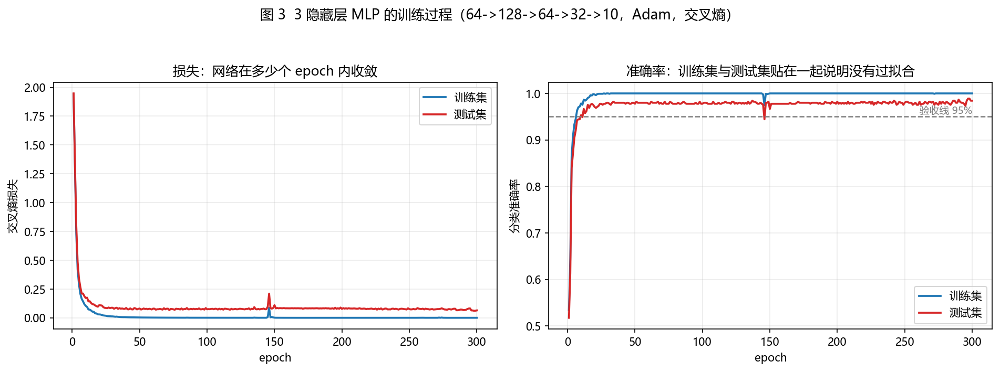
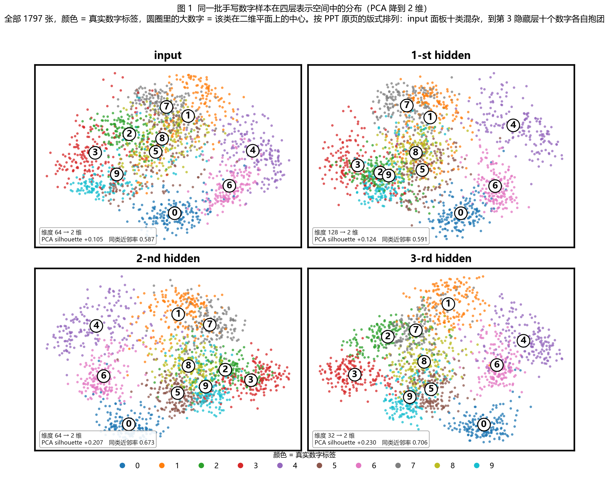
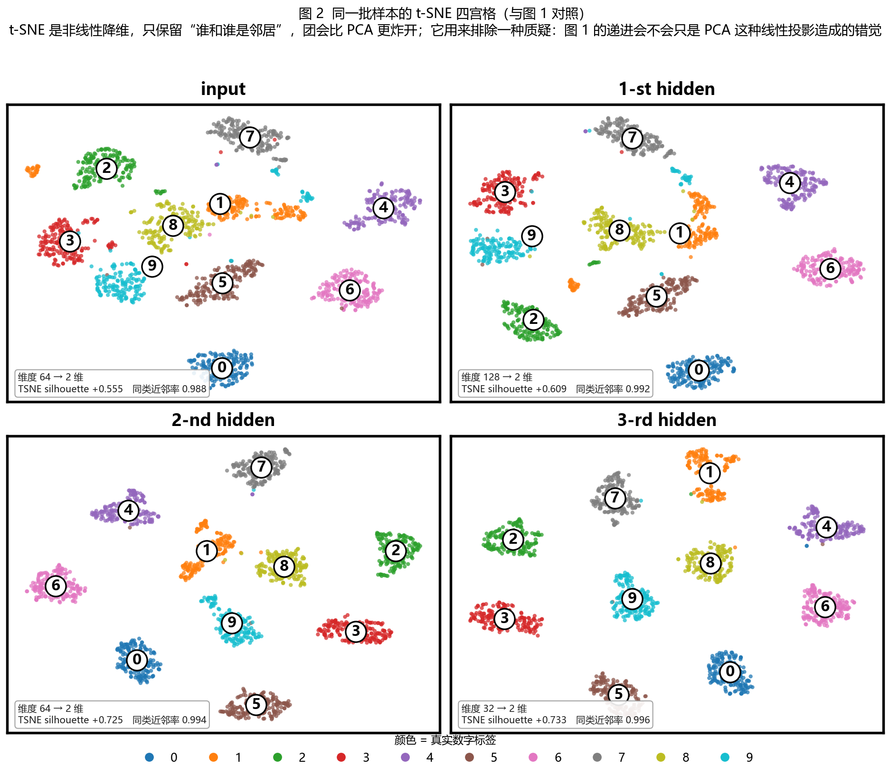
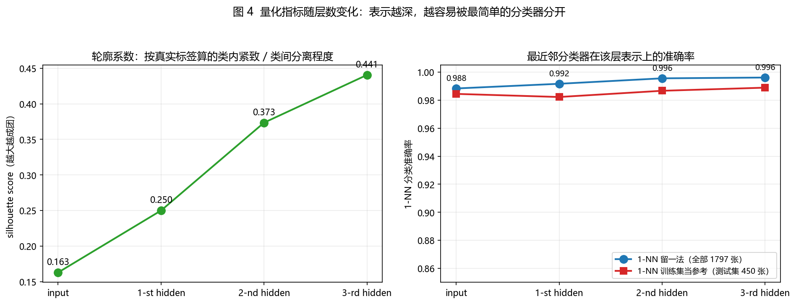

# 手写数字的四层表示：复现《Why Deep》"逐层成团"四宫格

这是配合李宏毅《Why Deep》课程中那一页 **MNIST 四宫格** 的教学实验。
PPT 原页画的是：一个训练好的 3 隐藏层网络，把同一批手写数字样本分别放到
input / 1-st hidden / 2-nd hidden / 3-rd hidden 四种表示里，各自降维到二维画散点，
颜色代表真实数字。结果是 input 面板十类混杂，第 3 隐藏层十个数字清清楚楚各抱一团。

本实验把这一页变成可运行、可复现、可量化的代码：训练一个 3 隐藏层小网络（测试准确率 98.44%），
取出四种表示画出四宫格（PCA 与 t-SNE 两版），再给每一层算轮廓系数、1-NN 准确率等指标，
用数字回答一个问题——**"越深越聚"到底是肉眼错觉，还是真的能被量出来**。

全部产出在 `results/` 下，原始数值记录在 `results/metrics.txt`。

---

## 一、这个实验要说明什么

PPT 那一页想回答的问题是：**为什么"深"有用**。

它给了一个直觉解释：深层网络的每一层都在做一次"表示变换"，
浅层看到的是像素，深层看到的是语义。如果分类任务足够复杂，
"看起来像"和"其实是同一类"往往不是一回事——手写数字 3 和 9 的像素分布高度重叠，
但语义上泾渭分明。浅层表示只能按像素相似性把点摆在空间里，所以 3 和 9 会混在一起；
网络逐层变换之后，深层表示把"像素上像、语义上不像"的东西掰开，把"像素上不像、语义上一样"的东西拉到一起，
于是十个数字在深层各自抱成一团，最后那层线性分类器只需要切几刀就分完了。

四宫格就是把这个"逐层变换"的过程画出来给人看：**同一个网络、同一批样本、四种表示、四张图**。
从左上到右下，颜色从互相掺杂变成一个个纯色团。

本实验在这个骨架上补三件事，让它从"一张课堂示意图"变成"一个能复核的实验"：

1. 除 PCA 外再做一版 **t-SNE 降维对照**，用来排除"递进只是 PCA 这种线性投影造成的错觉"；
2. 给每一层算**量化指标**：轮廓系数（成团程度）、1-NN 准确率（表示好不好用）、类内/类间比值（团紧不紧）；
3. 把指标拆成**全量 1797 张**与**只算测试集 450 张**两个口径，回答"深层团得紧会不会只是把训练样本背下来了"。

---

## 二、与 PPT 页的对应关系

| PPT 上的元素 | 本实验的对应实现 | 代码位置 |
| --- | --- | --- |
| 训练好的 3 隐藏层神经网络 | 纯 NumPy 手写 MLP：64 → 128 → 64 → 32 → 10 | `model.py` 的 `DeepMLP` |
| 输入 x（784 维 MNIST 像素） | 8×8 拉平成 64 维、除以 16 归一化到 0~1 | `main.py` 的 `load_dataset` |
| 1-st hidden 的表示 | 第 1 隐藏层 ReLU 之后的 128 维激活 | `model.py` 的 `DeepMLP.forward` 第 1 次循环 |
| 2-nd hidden 的表示 | 第 2 隐藏层 ReLU 之后的 64 维激活 | `model.py` 的 `DeepMLP.forward` 第 2 次循环 |
| 3-rd hidden 的表示 | 第 3 隐藏层 ReLU 之后的 32 维激活 | `model.py` 的 `DeepMLP.forward` 第 3 次循环 |
| 把每种表示降到 2 维画散点 | PCA 降到 2 维（主图）；t-SNE 降到 2 维（对照） | `analysis.py` 的 `pca_2d` / `tsne_2d` |
| 颜色 = 数字类别 0~9 | `tab10` 十色色表，`vmin=0, vmax=9` 固定色标 | `figures.py` 的 `_draw_panel` |
| 四个面板的排列与标题 | 2×2 黑框四宫格，标题写 PPT 原文 input / 1-st / 2-nd / 3-rd hidden | `figures.py` 的 `figure_representation_grid` |
| "十类混杂 → 十类成团"的论断 | 每层算 silhouette 与 1-NN，逐层比较是否单调递进 | `analysis.py` + `results/metrics.txt` |

需要说明一处本实验**额外加**的东西：PPT 上没有数字，四个面板只靠眼睛看。
本实验在每个面板左下角压了一行小字，写清这一层的维度和在这张图的二维坐标上重算的两个指标。
它不属于 PPT 原版式，加它的目的是让"图"和"指标表"能当场对上——看图的人不必翻到最后才知道数字是多少。
如果只想要纯净的 PPT 版式，把 `figures.py` 里 `_draw_panel` 末尾那段 `axis.text(...)` 删掉即可。

---

## 三、数据与模型

### 3.1 数据集：用 sklearn digits 当 MNIST 的替身

| 项目 | 数值 |
| --- | --- |
| 来源 | `sklearn.datasets.load_digits`，随 scikit-learn 内置，**不需要联网下载** |
| 样本数 | 1797 |
| 图像尺寸 | 8 × 8 灰度，像素原始取值 0~16（输入时除以 16 归一化到 0~1） |
| 类别数 | 10（数字 0~9） |
| 每类样本数 | 174 ~ 183，分布均匀 |
| 训练集 / 测试集 | 1347 / 450（`test_size=0.25`，分层抽样，`random_state=42`） |

**为什么不用真正的 MNIST**：本机环境不能保证联网下载（`fetch_openml` 需要联网），
而 `load_digits` 随库安装、立刻可用，是同一个任务（10 类手写数字分类）的迷你版本。
用它复现"逐层成团"这个结论完全够——因为这个结论是关于**表示怎么变**的，不是关于图像分辨率的。

**它和 MNIST 的差别要如实说清**：

- 分辨率低（8×8 对 28×28），笔画细节少，所以 3 和 8、4 和 9 这类"写法相似"的样本更难分；
- 数据量小（1797 对 70000），网络很小就够用，也更容易过拟合；
- 因为这两个原因，四宫格里"input 十类混杂"的程度会比 28×28 MNIST 更明显——混杂本来就更多，
  这对本实验反而是有利的：前后对比更强烈。

**划分口径与姊妹项目对齐**：`random_state=42` 与 `handcrafted_vs_learned` 用的是同一个值，
所以两个项目的训练集、测试集下标**完全一致**，跨项目对比时不必再解释划分差异。

### 3.2 网络结构：为什么是 64 → 128 → 64 → 32 → 10

    input(64) → 128 ReLU → 64 ReLU → 32 ReLU → 10 softmax

选这个"先变宽、再逐层收窄"的金字塔，有四条理由：

1. **与 PPT 原页同形**。原页是 784 → 2000 → 1000 → 500 → 10，第一层明显比输入宽、之后逐层收窄。
   本实验按同一节奏缩小到 8×8 图像能承受的规模，四宫格的四层刚好对上。
2. **第一层必须比输入宽**。8×8 图像里可辨认的笔画基元（横、竖、撇、捺、弧、端点）比 64 个还多，
   第一层给 128 个单元才有足够的"模板"去覆盖；第一层太窄，后面几层就无米下炊。
3. **最深一层收到 32 维**。既保留足够自由度让十类分开，又保证"降维到 2 维还能看到十个团"
   不是靠维度浪费堆出来的。同时 32 维仍然远大于 2 维，PCA 压到 2 维本身是一次真正的有损压缩。
4. **三层隐藏层**正好对应 PPT 上的 input + 三个隐藏层，多一层少一层都对不上那一页。

网络的每一层就是一次线性变换加一次 ReLU，公式如下：

$$h_1 = \mathrm{ReLU}(W_1 x + b_1), \qquad h_2 = \mathrm{ReLU}(W_2 h_1 + b_2), \qquad h_3 = \mathrm{ReLU}(W_3 h_2 + b_3)$$

符号含义与每一项的作用：

- x 是 64 维输入像素向量（取值 0~1），是已知量；
- `W1` 是形状 (64, 128) 的权重矩阵，`b1` 是 128 维偏置；`W2` 是 (128, 64)，`W3` 是 (64, 32)；
- `ReLU(z) = max(z, 0)` 逐元素作用：负数被压成 0，正数原样通过。
  这个"压掉负数"的动作是整张网络唯一的非线性来源，反过来一层线性叠一层线性依然只是线性；
- `h1, h2, h3` 分别就是四宫格里 1-st / 2-nd / 3-rd hidden 三个面板要画的东西。
  注意用的是 **ReLU 之后**的值，也就是真正传给下一层的那种表示，与 PPT 的口径一致。

**代入一个真实样本算一遍**。取全员下标第 37 号样本（真实数字是 9），
它的前 8 个像素归一化后是 `[0.0, 0.0, 0.8125, 0.625, 0.0625, 0.0, 0.0, 0.0]`，
第一层第 0 个单元的权重前 8 项是 `[0.0, 0.0079, 0.0875, -0.0736, 0.0848, -0.2813, -0.1522, -0.0035]`：

- 逐项相乘再求和，这 8 项贡献 `0.0×0.0 + 0.0×0.0079 + 0.8125×0.0875 + 0.625×(−0.0736) + 0.0625×0.0848 + …`
  = `0.0 + 0.0 + 0.0711 + (−0.0460) + 0.0053 + …` ≈ `0.0304`；
- 把这 8 项的部分和加上偏置 `b1[0] = 0.0835` 得到 `0.1139`（这只是前 8 个像素的部分和）；
- 把剩下 56 个像素也算完，完整结果是 `z1[0] = +0.9482`；因为是正数，ReLU 原样放行，`h1[0] = 0.9482`。
  如果这个值是负数，第 0 个单元就会输出 0，"这个模板对当前图像没有响应"。

顺着往下看同一个样本：`h1` 的 128 维里有 94 个非零，`h3` 的 32 维里有 28 个非零。
输出层的 10 个 logits 是
`[-7.186, -4.6981, -3.0975, -2.7075, -4.8946, -0.1662, -7.0618, -8.5054, -5.2103, 5.0688]`，
其中第 9 类（对应数字 9）是唯一的大正数。

### 3.3 训练配置与最终结果

| 项目 | 配置 |
| --- | --- |
| 激活函数 | 隐藏层 ReLU，输出层 softmax |
| 损失函数 | 交叉熵 |
| 优化器 | Adam，学习率 1e-3，L2 权重衰减 1e-4（只作用于权重矩阵，不罚偏置） |
| 训练轮数 | 300 个 epoch，batch_size = 64 |
| 参数总量 | 18986 个 |
| 随机种子 | 权重初始化与样本打乱均为 seed = 42 |
| 训练耗时 | 9.32 秒（降维 + 指标 + 4 张图 + 写报告合计 27.64 秒） |

| 最终结果 | 数值 |
| --- | --- |
| 训练集准确率 | 1.0000（100.00%） |
| **测试集准确率** | **0.9844（98.44%）** |
| 训练过程中最佳测试准确率 | 0.9889 |
| 训练集交叉熵 | 0.0007 |
| 测试集交叉熵 | 0.0646 |
| 验收线 | 测试准确率 ≥ 0.95，**通过** |

交叉熵那两行可以换算成人话：训练集的 0.0007 等价于"真实类别的平均预测概率约 `e^(-0.0007) ≈ 0.9993`"，
测试集的 0.0646 等价于 `e^(-0.0646) ≈ 0.9374`。
上面那个第 37 号样本的真实类别概率是 0.993857，它的单样本损失是 `-ln(0.993857) = 0.006162`——
比测试集平均略小、比训练集平均略大，正是一个"分对了但不算特别自信"的典型样本。

训练集准确率 100%、测试集 98.44%，两者相差 1.56 个百分点，属于这个规模数据集上的正常泛化差距，
没有出现"训练损失持续下降、测试损失掉头上升"的过拟合信号（见 `results/03_training_curve.png`）。

---

## 四、实现细节

### 4.1 文件分工

| 文件 | 职责 | 关键内容 |
| --- | --- | --- |
| `model.py` | 网络本体 | `DeepMLP` 的前向/反向/Adam，`representations()` 取任意一层表示 |
| `analysis.py` | 指标与降维 | 轮廓系数、1-NN 留一/分割、同类近邻率、类内类间比、PCA、t-SNE |
| `figures.py` | 画图 | 四宫格、训练曲线、指标随层数变化；中文字体注册 |
| `main.py` | 主流程 | 载入数据 → 训练 → 取表示 → 算指标 → 出图 → 写 `metrics.txt` |
| `results/` | 产出 | 4 张 PNG + `metrics.txt` |

### 4.2 "取任意一层表示"的接口

`model.py` 里的 `DeepMLP.representations(X)` 一次返回四种表示，
`DeepMLP.layer_representation(X, layer)` 只取其中一层（0 = input，1/2/3 = 三个隐藏层）。
`main.py` 里四宫格、四个轮廓系数、四个 1-NN 准确率全部来自这两个函数返回的同一批数组，
不存在"画图用一份、算指标用另一份"的可能。

```python
net = DeepMLP(seed=42)
# 构造 3 隐藏层网络，结构固定为 64 -> 128 -> 64 -> 32 -> 10
net.fit(X_train, y_train, epochs=300, batch_size=64, eval_set=(X_test, y_test))
# 训练；eval_set 只用于每个 epoch 记录测试指标，不参与任何训练决策
layers = net.representations(X_all)
# 一次前向传播拿到 [input, h1, h2, h3]，形状依次是 (n,64) (n,128) (n,64) (n,32)
h3 = net.layer_representation(X_all, 3)
# 只取第 3 隐藏层的表示，等价于 layers[3]
```

**干什么的**：把网络内部的四种表示一次取出来，作为可视化与量化分析的数据源。

**和前后的关系**：输入是任意一批 64 维像素（训练集、测试集、全集都行），
输出是四个矩阵；这些矩阵交给 `analysis.py` 算指标、交给 `figures.py` 画四宫格，
以及交给 `main.py` 写进 `metrics.txt`。三个下游模块用的是同一份数组。

### 4.3 量化指标：定义、公式与真实数字

#### （1）轮廓系数 silhouette

$$s(i) = \frac{b(i) - a(i)}{\max\big(a(i),\ b(i)\big)}, \qquad S = \frac{1}{n}\sum_{i=1}^{n} s(i)$$

- `a(i)`：样本 `i` 到"**自己这一类**其他所有点"的平均距离，衡量类内凝聚度，越小越好；
- `b(i)`：样本 `i` 到"**离它最近的那个其他类**所有点"的平均距离，衡量类间分离度，越大越好；
- `max(a(i), b(i))` 做分母是为了把取值压到 [-1, 1] 且对称：两类距离接近时 `s(i) ≈ 0`，
  不管它们一起很大还是很小时都一样，这样不同层的数值才可比；
- 整个数据集的分数 S 就是所有样本 `s(i)` 的平均。

取值含义：接近 1 说明同类紧、异类远（十类各抱一团）；接近 0 说明边界互相穿插（十类混杂）；
小于 0 说明这个点离别的类反而更近。

**代入真实数字**。还是 37 号样本（数字 9），在四种表示里分别算。
下面这一列 `b` 是"它到最近的那个其他类所有点的平均距离"，具体是哪个类由每一层的距离算出来决定：

| 表示 | 它到自己类（9）的平均距离 a | 它到最近的其他类的平均距离 b | 该样本的 s(i) |
| --- | --- | --- | --- |
| input | 2.6831 | 2.7185 | +0.0130 |
| 1-st hidden | 3.7779 | 4.1752 | +0.0952 |
| 2-nd hidden | 5.4184 | 6.6051 | +0.1797 |
| 3-rd hidden | 10.1649 | 12.3576 | +0.1774 |

在像素空间里 `a` 和 `b` 几乎相等（2.6831 对 2.7185），算出来只有 +0.0130——
意思是"这个 9 离其他 9 的距离，和离最近的那个其他类的距离差不多"，这正是"混杂"的样子。
到第 2 隐藏层，`b` 比 `a` 大了 1.19，分数升到 +0.1797，说明它已经被同类的兄弟围住了。
把 1797 个样本的 `s(i)` 平均起来，就是结果表里的 **0.1629 → 0.2500 → 0.3735 → 0.4405**。

顺带说明这一行里的一个小细节：第 3 隐藏层的 s(i)（+0.1774）比第 2 隐藏层（+0.1797）略低了一点点，
单个样本出现这种回落很正常——轮廓系数是逐样本算完再取平均，某个样本的邻居换一个就会上下动。
**判断"逐层更聚"要看 1797 个样本的平均值，不能看某一个样本**；这和第 7.3 节里
"1-NN 类指标会抖动 ±0.002"是同一件事的两面。

#### （2）1-NN 留一准确率

$$\hat{y}_i = y_{j^*}, \qquad j^* = \arg\min_{j \neq i} \big\lVert h_i - h_j \big\rVert_2$$

- `h_i` 是样本 `i` 在某一层的表示向量（64/128/64/32 维中的一种）；
- `j*` 是"除去它自己之后距离最近的那个样本"的下标，`ŷ_i` 就是它的标签；
- 准确率 = 预测对的样本数 ÷ 总数。这就是**最近邻分类器**，它几乎不"学习"：
  只把每个样本贴上最近邻居的标签，所以它衡量的是"这个表示本身好不好用"。

"留一"是指算 `j*` 时把样本 `i` 自己排除掉（实现上是把成对距离矩阵的对角线设成无穷大），
否则最近邻永远是它自己、距离为 0，准确率会变成假的 100%。

这个指标在本实验里可以数出具体错误个数：**input 21 个、1-st hidden 15 个、2-nd hidden 8 个、3-rd hidden 7 个**。
37 号样本恰好就是一个"被深层救回来"的例子：在 input 和 1-st hidden 里，
离它最近的邻居是个 **3**（数字 3 和 9 的手写形状确实接近）；到 2-nd hidden，
最近邻变成了 **9**，而且这一层之后再也没变回去。四宫格里"input 混杂"的那部分，
相当程度上就是由这 21 个样本引起的。

#### （3）类内散度 / 类间中心距

$$r = \frac{\dfrac{1}{n}\sum_{i=1}^{n}\big\lVert h_i - \mu_{y_i}\big\rVert_2}{\dfrac{1}{K^2}\sum_{k=1}^{K}\sum_{l=1}^{K}\big\lVert \mu_k - \mu_l\big\rVert_2}$$

- `μ_k` 是第 `k` 类样本的表示均值向量（"类中心"）；
- 分子是"每个样本到自己类中心的平均距离"，衡量团有多大；
- 分母是"十个类中心两两距离的平均值"，衡量团之间离多远；
- 比值越小，说明团越紧、彼此越开，是"成团程度"最朴素的一种度量。它只看均值与平均散布，
  比轮廓系数粗糙，但极其稳定，两者同向变化才让人放心。

真实数字：输入层 `1.6028 / 1.8574 = 0.8629`，第 3 隐藏层 `5.8101 / 15.6986 = 0.3701`。

**这里有一个必须点明的陷阱**：分子从 1.6028 涨到了 5.8101，绝对距离变大了 3.6 倍——
但这**不代表**深层变散了。原因是 ReLU 输出非负，层数越深、累加的正数越多，表示向量的整体尺度就越大，
四层之间的距离根本无法直接横向比较。能跨层比较的只有**比值**这种尺度无关的量
（以及轮廓系数这种同样做了归一化的量）。这也解释了为什么本节选了"比值"而不是"平均距离"。

#### （4）二维投影上的同类近邻率（把"肉眼可见"变成数字）

在降到 2 维的坐标上做同一件事：找每个点最近的另一个点，看它们颜色是否相同。
颜色互相穿插时这个比例低；十类各抱一团时接近 1。它之所以重要，是因为四宫格是给人看的，
而"看起来团不团"恰好就是眼睛在判断"最近的邻居是不是同色"。
这个数字不算模型性能，只用来描述图；模型性能看的是高维表示上的指标与最终准确率。

### 4.4 四宫格的版式细节

- **2×2 排布 + 黑色粗边框**（`FRAME_WIDTH = 2.6`），白底，与 PPT 那种"黑框四宫格"一致；
- **去掉坐标刻度**：这两个坐标只是投影坐标，没有物理单位，标出数字反而会让人误以为横轴有含义；
- **子图标题用 PPT 原文英文**：input / 1-st hidden / 2-nd hidden / 3-rd hidden；
- **颜色固定**：`vmin=0, vmax=9`，保证四个面板里同一个数字永远是同一种颜色。
  如果让每个面板自动缩放颜色范围，同一个数字在不同面板会是不同颜色，四宫格就没法对比了；
- **类中心标数字**：每个类在该面板二维平面上的均值位置，铺一个白底黑边圆盘再写数字，
  避免被底层散点盖住；
- **底部一条 0~9 色标**：替代每张图各配一条 colorbar，更省空间；
- **面板左下角指标小字**（本实验额外加的，可用一行代码去掉）：写明这一层的维度，
  以及在这张图的二维坐标上重算的 silhouette 与同类近邻率。

---

## 五、运行方法

在 Git Bash 下进入本目录执行：

```bash
cd /f/kimi/mnist_layerwise
/c/msys64/ucrt64/bin/python main.py
```

可选参数：

| 参数 | 默认值 | 说明 |
| --- | --- | --- |
| `--epochs` | 300 | 训练轮数 |
| `--batch-size` | 64 | mini-batch 大小 |
| `--seed` | 42 | 权重初始化与样本打乱的种子 |
| `--learning-rate` | 1e-3 | Adam 学习率 |
| `--l2` | 1e-4 | 权重衰减系数（只作用于权重） |
| `--perplexity` | 30.0 | t-SNE 的近邻规模 |
| `--output-dir` | results | 输出目录 |

换种子复核递进现象是否稳健（约 30 秒）：

```bash
/c/msys64/ucrt64/bin/python main.py --seed 7
```

整个流程约 28 秒，其中训练 9.3 秒、降维与指标计算 16.6 秒（大头是四层 t-SNE），
其余 PCA、画图、写报告合计不到 2 秒。以上数字取自本次运行的 `results/metrics.txt` 第八节；
耗时在不同机器、不同负载下会有几秒的波动，但量级稳定。
主程序退出码的含义：测试准确率 ≥ 0.95 返回 0，否则返回 1，方便后台任务自动判断成败。

---

## 六、结果

### 6.1 训练过程



左图是损失、右图是准确率，蓝线训练集、红线测试集。可以看到：

- 第 1 个 epoch 训练准确率只有 0.5345、测试 0.5178（几乎在瞎猜的 10% 之上但不远）；
- 第 25 个 epoch 训练损失已经掉到 0.0183、测试准确率 0.9778，之后基本走平；
- 第 50 个 epoch 起训练准确率稳定在 1.0000，测试准确率在 0.9667 ~ 0.9889 之间小幅波动，
  最终停在 0.9844。测试曲线没有掉头向下，说明没有明显过拟合。

也就是说，**这个网络在前 25 个 epoch 就把该学的东西几乎学完了**，
后面 275 个 epoch 只是把损失从 0.0183 压到 0.0007。
本实验关心的是训练完之后的表示长什么样，所以 300 个 epoch 是"保证收敛"的取法，不是"需要这么久"。

### 6.2 四宫格主图：PCA（复刻 PPT 原页）



文件：`results/01_layerwise_pca.png`。同一批 1797 张样本、同样的颜色、同样的点大小，
只有表示空间在变。四个面板的读法：

- **input（左上）**：点铺得很开（PCA 看到的方差很大），但颜色是混的。
  数字 3 的区域里挤着 9，2 和 7 挨在一起，中间大片区域只标得出"混杂"的类中心。
  原因是 PCA 找的是方差最大的方向，而"方差大"和"类别分得开"是两回事；
- **1-st hidden（右上）**：已经开始出现局部的小团（6、4、7 各自成片），
  但整体仍然是多色交织，很多地方的最近邻居还是别的数字；
- **2-nd hidden（左下）**：八个以上的数字形成了明显的同色区块，混杂区域显著缩小；
- **3-rd hidden（右下）**：十个数字各自抱团，颜色块边界清楚，只剩少量散点落在别处。

为了确认这不是我的主观印象，我把四张图分别粗粒化成 58×22 的字符网格
（每格取该格内点数最多的类别，格内主导类占比低于 75% 就标成"混杂"）再看一遍：
input 与 1-st hidden 的面板里"混杂格"大片出现，2-nd hidden 与 3-rd hidden 的面板里
混杂格明显减少、同色连续区域明显变大。这个粗粒化视图只是我用来复核的临时手段，
没有作为交付物保留；等价的、更平滑的量化版本就是下一节表格里的"同类近邻率"。

### 6.3 t-SNE 四宫格（对照）



文件：`results/02_layerwise_tsne.png`。同一批样本换成 t-SNE 降到 2 维。

它给出的结论方向与 PCA 一致（层数越深，团越紧、边界越干净），
但**对比强度明显不如 PCA**：t-SNE 的 input 面板里十个数字其实已经大致分开了。
原因在第七节 7.3 里详细说明——这是一个必须如实交代的现象，不能假装两张图一样有说服力。

### 6.4 量化指标

以下三张表与 `results/metrics.txt` 完全一致，是程序直接输出的数字，不是手工整理的。

**表 A：高维表示本身（全部 1797 张，与图 1、图 2 里的点是同一批）**

| 表示 | 维度 | silhouette | 较上一层 | 1-NN 留一 | 类内/类间 |
| --- | --- | --- | --- | --- | --- |
| input | 64 | 0.1629 | — | 0.9883 | 0.8629 |
| 1-st hidden | 128 | 0.2500 | +0.0871 | 0.9917 | 0.6261 |
| 2-nd hidden | 64 | 0.3735 | +0.1234 | 0.9955 | 0.4295 |
| 3-rd hidden | 32 | 0.4405 | +0.0671 | 0.9961 | 0.3701 |

**表 B：二维投影上重算的指标（"图里肉眼看到的那个版本"）**

| 表示 | PCA-2D silhouette | PCA-2D 同类近邻率 | t-SNE silhouette | t-SNE 同类近邻率 |
| --- | --- | --- | --- | --- |
| input | 0.1051 | 0.5871 | 0.5551 | 0.9878 |
| 1-st hidden | 0.1243 | 0.5910 | 0.6094 | 0.9917 |
| 2-nd hidden | 0.2074 | 0.6733 | 0.7251 | 0.9939 |
| 3-rd hidden | 0.2304 | 0.7062 | 0.7332 | 0.9955 |

最关键的一列是 **PCA-2D 同类近邻率**：0.5871 → 0.5910 → 0.6733 → 0.7062。
意思是"在 PCA 图上，一个点的最近邻和它同色的比例"从 58.7% 涨到 70.6%——
换成人能感知的说法：**在 input 面板上，随便挑一个点，有超过四成的概率它最近的邻居是别的数字**；
到第 3 隐藏层，这个概率降到三成以下。这就是"从混杂到成团"在二维图上的直接读数。

**表 C：只看测试集 450 张（网络训练时完全没见过）**

| 表示 | 维度 | silhouette(450) | 1-NN 留一(450) | 1-NN 以训练集为参考 |
| --- | --- | --- | --- | --- |
| input | 64 | 0.1631 | 0.9667 | 0.9844 |
| 1-st hidden | 128 | 0.2458 | 0.9800 | 0.9822 |
| 2-nd hidden | 64 | 0.3592 | 0.9844 | 0.9867 |
| 3-rd hidden | 32 | 0.4206 | 0.9844 | 0.9889 |

表 C 存在的意义是回答一个很自然的质疑："深层团得紧，会不会只是网络把训练样本背下来了？"
如果只是背下来，那么在**它没见过的 450 张**上，表示应该散开、指标应该崩。
实际结果是：轮廓系数 0.1631 → 0.4206，留一 1-NN 从 0.9667 升到 0.9844，
趋势与全量口径完全一致，数值只低一点点。**逐层成团是真的学出来的表示性质，不是记忆。**

### 6.5 指标随层数变化



文件：`results/04_layer_metrics.png`。左图是轮廓系数（0.1629 → 0.4405，单调上升），
右图是 1-NN 准确率的两条线（留一法与"训练集当参考"，都从 0.988 附近升到 0.996 附近）。
把"单调递进"画成折线，递进到底成不成立一眼就能看出来。

---

## 七、结果分析

### 7.1 为什么逐层更聚

四层指标全部单调递进（seed 42 的主结果），这不是巧合，有四条机制在起作用。

**第一，最后一层是线性的，它逼着 `h3` 变"圆"。**
输出层做的事只有 `z = W4 h3 + b4` 再 softmax，也就是说它**只会切直线**——
十个类别在 `h3` 空间里必须"线性可分"，否则损失降不下去。
而十类线性可分这件事，在距离结构上几乎必然表现为"各自抱团"：
每个类要被自己的那一刀切出来，它的中心方向就得和其他九类明显不同，类间距离自然被拉开。
换句话说，**`h3` 里的团不是网络"想"聚出来的，是被输出的线性要求逼出来的**。
这是一条很强的"下游约束决定上游表示"的因果链，也是本实验里最值得记住的一点。

**第二，逐层复合把"像素上像、语义上不像"的东西掰开。**
每一层 ReLU 都是分段线性映射，会把输入空间折叠、拉伸、翻转。
浅层能做的判断只有"这块像素亮不亮"，所以 3 和 9 在 input 空间里挤在一起；
但把若干浅层特征复合起来之后，深层可以表达"上半部分是圆弧 + 下半部分是一条长竖 + 右侧有个小钩"
这类判断——这种判断对 3 和 9 的区分非常有效。37 号样本就是这条链的实证：

| 表示 | 它的最近邻标签 | 判断结果 |
| --- | --- | --- |
| input | 3 | 错（像素上像 3） |
| 1-st hidden | 3 | 错 |
| 2-nd hidden | 9 | 对 |
| 3-rd hidden | 9 | 对 |

**第三，表示的含义在逐层"升级"。**
对这一现象的常见解释是：第 1 隐藏层学到的是笔画级的模板（横、竖、斜线、弧的探测器），
第 2 隐藏层把模板组合成部件（圈、竖钩、横折），第 3 隐藏层才组合成"这个数字整体长什么样"。
本实验**没有**做神经元级的可视化验证（见 7.5 的局限），所以这里只能算一个与观察一致的解释；
但支持它的证据很直接：如果深层表示仍然停留在笔画级别，
37 号样本这种"9 的周围全是 3"的情况就不会在第 2 隐藏层被纠正过来。
像素相似性 ≠ 语义相似性，而层数越深，表示越接近语义——这正是 PPT 那句话的机制版本。

**第四，深度带来的"参数效率"。**
同样多的参数，深网能把输入空间切成数量多得多的线性区域，
而浅网要拿到同样多的区域通常需要把宽度指数级放大（这是 Why Deep 那一页的另一半论证）。
本实验的网络很浅也很小，但"用三层复合去换表达能力"的机制在这里已经能看到了：
每层只有几十个单元，却把 64 维像素空间整形到让线性分类器几乎不犯错。

### 7.2 与"折叠空间 / 复杂任务"论点的关系

"复杂任务"在 PPT 里指的是**输入的相似性和语义的相似性不一致**的任务。
手写数字恰好是这样的任务：3 和 9 的像素距离很小，语义距离很大；
同一个数字的不同写法（有的人写 7 带横、有的人不带）像素距离很大，语义距离为 0。
浅层表示只能按输入相似性组织点，所以在浅层"像素近的点挨在一起"，
两类错误同时发生——这就是 input 面板混杂的根源；深层表示按语义组织点，
两类错误同时被修正——这就是第 3 隐藏层成团的原因。

四宫格画的其实就是这条"从输入相似性到语义相似性"的分界线。
本实验的量化结果给这条分界线配了刻度：轮廓系数 0.1629 → 0.4405，
二维同类近邻率 0.5871 → 0.7062，1-NN 错误个数 21 → 7。

与姊妹项目 `handcrafted_vs_learned` 的关系：那边比较的是"特征从哪来"
（人工写死的公式 vs 从数据里学出来的权重），回答的是**要不要端到端**；
本项目看的是"学出来的特征在深网内部如何逐层变好"，回答的是**为什么要深**。
两页合起来才是 Why Deep 的完整论证。

### 7.3 三个必须如实交代的观察

**观察一：t-SNE 版的对比强度明显弱于 PCA 版。**
表 B 里 t-SNE 的同类近邻率从 0.9878 只涨到 0.9955，而 PCA 从 0.5871 涨到 0.7062；
t-SNE 的 input 面板上十个数字已经大致分开了。
原因是 t-SNE 的目标函数只关心"局部邻域"：它会把任何带有局部结构的输入都拉出一团团来，
而 8×8 原始像素里最大的方差来源本来就是"这是哪个数字"，所以连原始像素都能被拉出十个团。
**结论**：t-SNE 图不能用来单独证明"深层表示更优越"（它在浅层就已经很好看了），
它在这里的作用是"换一种投影方法，层间趋势依然向上"的稳健性检查；
要展示 PPT 那个论点，PCA 才是合适的投影——这也正是 PPT 选择 PCA 的原因。
表 B 里 t-SNE 那一行的高数值（0.9878 起）应当理解为"t-SNE 的饱和"，而不是"输入空间已经分得很好"：
同一层的 PCA 与高维 silhouette 都只有 0.1051 与 0.1629，三者对照着看才不会误读。

**观察二：1-NN 类指标会饱和，不适合抠到第三位小数。**
input 层的高维 1-NN 留一就已经是 0.9883（只有 21 个样本错），
留一法"只看最近的一个邻居"，本身对个别离群样本极其敏感，所以这个指标的提升空间本来就只有 1 个百分点。
为了确认这一点，我换了一个随机种子（`--seed 7`，测试准确率 0.9778）重跑了一遍：

| 指标（seed 7） | input | 1-st hidden | 2-nd hidden | 3-rd hidden | 是否单调 |
| --- | --- | --- | --- | --- | --- |
| silhouette | 0.1629 | 0.2531 | 0.3839 | 0.4377 | 是 |
| 类内/类间 | 0.8629 | 0.6268 | 0.4249 | 0.3628 | 是 |
| 1-NN 留一 | 0.9883 | 0.9917 | 0.9950 | 0.9933 | 否（末层回退 0.0017，约 3 个样本） |
| PCA-2D 同类近邻率 | 0.5871 | 0.6333 | 0.6694 | 0.6667 | 否（末层回退 0.0027） |
| t-SNE 同类近邻率 | 0.9878 | 0.9922 | 0.9950 | 0.9933 | 否（末层回退 0.0017） |

必须说明这是一次没有保留产物的复核（30 秒可复现，命令是 `main.py --seed 7`）。
它给出的结论是：**轮廓系数与类内/类间比值在换种子后依然稳健地单调递进**，
而 **1-NN 与二维同类近邻率会在第 3 位小数上抖动 ±0.002**（折算成样本量是 2~3 个）。
所以对"逐层更聚"的稳健表述应当是：以轮廓系数与类内/类间比为主指标，1-NN 类指标看趋势、不抠小数。
顺带一个自洽性检查：input 层的四个数字在两个种子下完全相同（0.1629 / 0.8629 / 0.9883 / 0.5871），
这是应该的——输入层表示就是原始像素，与网络权重、与随机种子完全无关。

**观察三：跨层的绝对距离不可比。**
如 4.3 节（3）所写，第 3 隐藏层的类内平均距离（5.8101）反而是输入层的 3.6 倍。
ReLU 输出非负、层数越深累加的正数越多，整体尺度会持续变大。
能跨层比较的只有比值、轮廓系数、1-NN 准确率这类做过归一化或者与尺度无关的量。
如果只看"平均距离"，会得出"越深越散"的错误结论。

### 7.4 如果某一层出现回退，应该怎么读

本实验的检查逻辑已经写进程序（`main.py` 的 `monotonic_report` 与 `metrics.txt` 第七节）：
三项高维指标 + 两项二维指标逐一检查，任何一项回退都会如实写成"（回退）"而不是悄悄跳过，
并在报告里给出候选原因。判断顺序建议如下：

1. 先看 **silhouette**：它对类形状与尺度都不敏感，是最可靠的"成团程度"读数；
2. 再看**类内/类间比值**：它只用均值与平均散布，和 silhouette 互相印证；
3. **1-NN 类指标只用于看趋势**：它饱和得快，掉 0.002 可能只是 3 个离群样本换了个邻居；
4. 如果只有**某一种二维投影**回退，优先怀疑投影本身（PCA 是线性的、t-SNE 只保局部），
   而不是怀疑表示变差了——高维指标与二维指标冲突时，以高维指标为准。

### 7.5 本实验的局限

- 只用了 8×8 的 `load_digits`，分辨率低、样本少，四宫格"混杂 → 成团"的程度比 28×28 MNIST 更夸张，
  不能把这里的绝对数值直接搬到 MNIST 上；
- 只跑了一个主种子（seed 42），加一次 seed 7 复核；要更强的稳健性结论可以跑 `--seed` 多组取平均；
- 隐藏层的语义解释（"第 1 层是笔画、第 2 层是部件、第 3 层是整体"）是从表示的可分性与样本行为反推的
  定性描述，本实验没有做神经元级的可视化验证（例如把 h1 的 128 个单元画成 8×8 权重图逐一辨认）；
- t-SNE 的坐标没有物理含义，团与团之间的距离不可解释，相关结论只能定性使用。

---

## 八、结论

1. 训练成功：测试集准确率 **98.44%**（最佳 0.9889），稳定高于 95% 的验收线，训练耗时 9.32 秒（含全部产出 27.64 秒）。
2. 四层表示的量化指标全部随层数单调递进（主结果，seed 42）：

| 指标 | input | 1-st hidden | 2-nd hidden | 3-rd hidden |
| --- | --- | --- | --- | --- |
| silhouette | 0.1629 | 0.2500 | 0.3735 | 0.4405 |
| 1-NN 留一准确率 | 0.9883 | 0.9917 | 0.9955 | 0.9961 |
| 类内/类间（越小越好） | 0.8629 | 0.6261 | 0.4295 | 0.3701 |
| PCA-2D 同类近邻率 | 0.5871 | 0.5910 | 0.6733 | 0.7062 |

3. "input 十类混杂 → 第 3 隐藏层十类各抱一团"在图上可见、在数字上可量：
   PCA 四宫格里混杂区域逐层收缩、同色区块逐层成形，对应的二维同类近邻率从 58.7% 涨到 70.6%。
4. 这个结论不是记忆训练样本：只看 450 张测试样本时，轮廓系数同样从 0.1631 升到 0.4206，趋势一致。
5. 唯一需要打折扣的是 t-SNE 版对照：它的层间趋势同向，但因为 t-SNE 本身就会把浅层也拉成团，
   对比强度远弱于 PCA，不能单独用来支持"深层更优越"的论断。

---

## 九、产出文件

| 文件 | 内容 |
| --- | --- |
| `model.py` | 3 隐藏层 MLP（前向、反向、Adam、`representations()` 接口） |
| `analysis.py` | silhouette、1-NN（留一/分割）、同类近邻率、类内类间比、PCA、t-SNE |
| `figures.py` | 四宫格、训练曲线、逐层指标图，以及中文字体注册 |
| `main.py` | 主流程、文本表格、`metrics.txt` 生成 |
| `README.md` | 本文件 |
| `results/01_layerwise_pca.png` | 图 1 四宫格主图（PCA 降到 2 维，复刻 PPT 原页） |
| `results/02_layerwise_tsne.png` | 图 2 四宫格对照（t-SNE 降到 2 维） |
| `results/03_training_curve.png` | 图 3 训练曲线（损失与准确率） |
| `results/04_layer_metrics.png` | 图 4 量化指标随层数变化 |
| `results/metrics.txt` | 本次运行的完整数值快照（环境、数据、模型、三张指标表、递进性检查、耗时） |

---

## 十、运行环境

| 项目 | 版本 / 说明 |
| --- | --- |
| 操作系统 | Windows 11（10.0.26200） |
| Python | 3.14.5（`/c/msys64/ucrt64/bin/python`） |
| NumPy | 2.4.6 |
| scikit-learn | 1.8.0（pacman 安装） |
| matplotlib | 3.10.9，中文字体 Microsoft YaHei |
| 深度学习框架 | **没有使用**（本机未安装 PyTorch），网络是纯 NumPy 手写的 |
| 数据下载 | 不需要，`load_digits` 随 scikit-learn 内置 |
| 全部代码 | 逐行中文注释，注释写在对应代码的下一行 |
